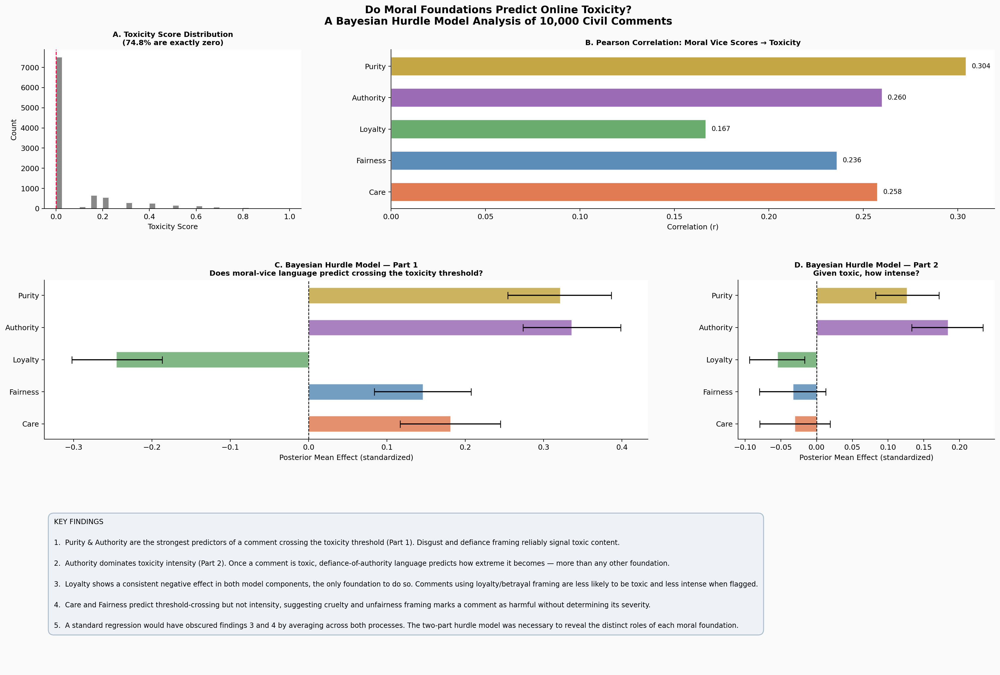

# Do Moral Foundations Predict Online Toxicity?
### A Bayesian Hurdle Model Analysis of 10,000 Civil Comments



---

## Research Question

Do comments exhibiting moral-emotional language patterns, as identified by 
Moral Foundations Theory, receive systematically higher toxicity ratings, 
and does this effect vary across moral dimensions (care, fairness, loyalty, 
authority, purity)?

---

## Key Findings

1. **Purity and Authority** are the strongest predictors of a comment crossing 
   the toxicity threshold. Disgust and defiance-of-authority framing reliably 
   signal toxic content.

2. **Authority dominates toxicity intensity.** Once a comment is toxic, 
   defiance-of-authority language predicts how extreme it becomes — more than 
   any other moral foundation.

3. **Loyalty shows a consistent negative effect** in both model components, 
   the only foundation to do so. Comments using loyalty or betrayal framing are 
   less likely to be toxic and less intense when flagged.

4. **Care and Fairness predict threshold-crossing but not intensity**, suggesting 
   cruelty and unfairness framing marks a comment as harmful without determining 
   its severity.

5. **A standard regression would have obscured findings 3 and 4** by averaging 
   across both processes. The two-part hurdle model was necessary to reveal the 
   distinct roles of each moral foundation.

---

## Dataset

**Google Civil Comments** — 1.8 million real online comments with 
human-annotated toxicity scores from 0.0 to 1.0, covering six dimensions: 
toxicity, severe toxicity, obscenity, threat, insult, and identity attack.

- Source: [Hugging Face — google/civil_comments](https://huggingface.co/datasets/google/civil_comments)
- Sample used: 10,000 comments (stratified from the training split)
- License: CC0 1.0 (public domain)

**Key characteristic:** 74.8% of comments score exactly zero on toxicity which is 
a severe zero-inflation that makes standard regression inappropriate and 
motivates the hurdle model approach.

---

## Methods

### 1. NLP Feature Engineering i.e. Moral Foundations Scoring
Each comment was scored on five moral dimensions using zero-shot classification 
(`facebook/bart-large-mnli`). Moral Foundations Theory (Haidt & Graham, 2007) 
posits that human moral reasoning organizes around five innate foundations:

| Foundation | Vice framing used as predictor |
|---|---|
| Care | cruel, harmful, causing pain or suffering |
| Fairness | unfair, cheating, discrimination |
| Loyalty | betrayal, disloyalty, treason |
| Authority | disrespect, defiance, subversion of authority |
| Purity | disgusting, degrading, depraved, morally corrupt |

### 2. Bayesian Hurdle Model (PyMC)
A two-part model addressing the zero-inflation in the outcome:

**Part 1 — The hurdle (Logistic regression):**  
Does moral-vice language predict whether a comment crosses the toxicity 
threshold at all?

**Part 2 — The intensity (Beta regression):**  
Among toxic comments, does moral-vice language predict how extreme the 
toxicity score is?

Both parts use weakly informative Normal(0,1) priors on standardized 
predictors. Posterior inference via NUTS sampler, 4 chains × 1000 draws.  
Convergence confirmed by R-hat < 1.01 across all parameters.

---

## Project Structure
├── notebooks/

│   ├── 01_data_exploration.ipynb        # Data loading and EDA

│   ├── 02_moral_foundations.ipynb # NLP scoring pipeline (run on Colab)

│   ├── 03_bayesian_model.ipynb          # Hurdle model (run on Colab)

│   └── 04_visualization.ipynb          # Summary figures

├── src/

│   └── config.py                        # Paths and settings

├── data/

│   ├── 01_score_summary

│   └── 02_civil_comments_with_mf_scores.csv  # Enriched dataset

├── outputs/

│   └── figures/                           # All saved charts

├── requirements.txt

└── README.md
---

## Reproducing This Project

### Requirements
- Python 3.10+
- A free [Hugging Face account](https://huggingface.co) and read token
- A free [Google account](https://colab.research.google.com) for Colab

### Steps

**1. Clone the repo**
```bash
git clone https://github.com/iamahmadyasin/civil-comments-moral-foundations.git
```

**2. Install dependencies**
```bash
pip install -r requirements.txt
```

**3. Run notebook 01 locally**
Open `notebooks/01_data_exploration.ipynb` in VS Code or Jupyter.  
Add your Hugging Face token to `src/config.py` where indicated.

**4. Run notebooks 02–04 on Google Colab**
Upload to [colab.research.google.com](https://colab.research.google.com).  
Set runtime to **T4 GPU** (Runtime → Change runtime type).  
Notebook 02 takes approximately 2–3 hours on CPU or 1 hour on GPU.

> **Note:** Posterior trace files (`.nc`) are not included in this repository 
> due to file size. They are regenerated automatically by running notebook 03.

---

## Results Summary

| Foundation | Correlation (r) | Hurdle effect | Intensity effect |
|---|---|---|---|
| Purity | 0.304 | +0.33 | +0.13 |
| Authority | 0.260 | +0.33 | +0.19 |
| Care | 0.258 | +0.19 | ~0 |
| Fairness | 0.236 | +0.14 | ~0 |
| Loyalty | 0.167 | **−0.24** | **−0.05** |

Hurdle and intensity effects are posterior means on standardized predictors.  
~0 indicates the 94% HDI spans zero (uncertain direction).

---

## Tools and Libraries

| Purpose | Library |
|---|---|
| Data streaming | `datasets` (Hugging Face) |
| NLP classification | `transformers`, `torch` |
| Bayesian modeling | `pymc`, `arviz` |
| Data manipulation | `pandas`, `numpy` |
| Visualization | `matplotlib`, `seaborn` |
| Compute | Google Colab (T4 GPU) |

---

## References

- Haidt, J., & Graham, J. (2007). When morality opposes justice: Conservatives 
  have moral intuitions that liberals may not recognize. *Social Justice Research.*
- Borkan, D. et al. (2019). Nuanced metrics for measuring unintended bias with 
  real data for text classification. *WWW '19 Companion.*  
  [arxiv.org/abs/1903.04561](https://arxiv.org/abs/1903.04561)
